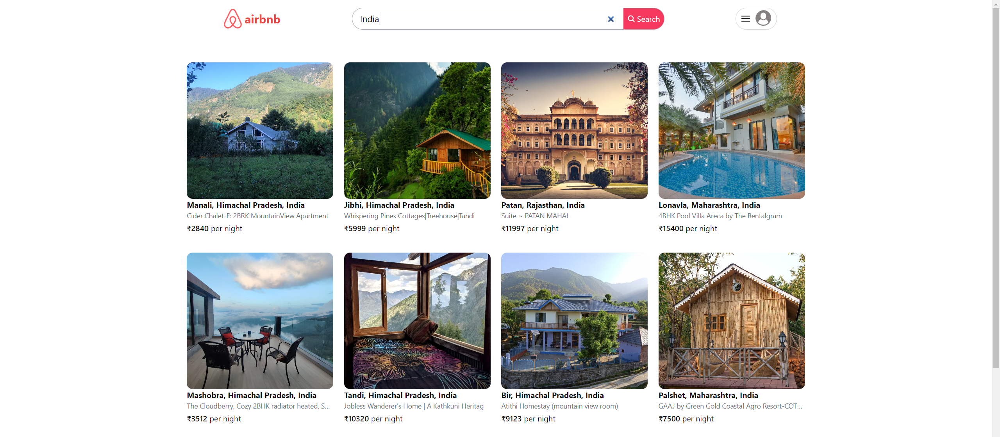
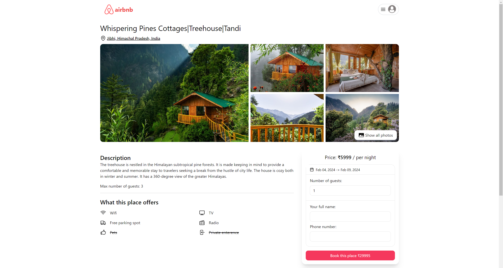

# Airbnb Clone Web Application

## Project Overview

Welcome to the Airbnb Clone! This full-stack web application mimics the core features of Airbnb, offering a platform for users to find and book accommodations, explore property listings, and manage their own properties. The application is developed using the MERN stack (MongoDB, Express.js, React.js, Node.js) for a robust and scalable solution.

## How It Works

### Project Structure

- **Frontend:** Built with React.js for a dynamic user interface.
- **Backend :** Powered by Node.js and Express.js, handling server-side logic and API endpoints.

### Features

- **User Authentication:** Securely sign up, log in, and log out. Integrate with Google for easy authentication.
- **Search and Explore:** Users can search for and explore various accommodations.
- **Detailed Listings:** View detailed property information, including photos and amenities.
- **Booking System:** Authenticated users can book accommodations for selected dates.
- **Host Management:** Hosts can manage their property listings by adding, editing, or removing them.
- **Responsive Design:** Designed to work seamlessly on both desktop and mobile devices.

## Getting Started

Follow these steps to set up and run the Airbnb Clone on your local machine.

### 1. Clone the Repository

Begin by cloning the project repository:

```bash
git clone https://github.com/rahul4019/airbnb-clone.git
cd airbnb-clone
```

### 2. Set Up the Frontend

1. Navigate to the `frontend` directory:

    ```bash
    cd frontend
    ```

2. Install the required dependencies:

    ```bash
    npm install
    ```

### 3. Set Up the Backend

1. Move to the `backend` directory:

    ```bash
    cd ../backend
    ```

2. Install the backend dependencies:

    ```bash
    npm install
    ```

### 4. Configure Environment Variables

#### For the Frontend

1. Create a `.env` file in the `frontend` directory.
2. Add the following environment variables:

    ```
    VITE_BASE_URL=http://localhost:4000
    VITE_GOOGLE_CLIENT_ID=your_google_client_id
    ```

#### For the Backend

1. Create a `.env` file in the `backend` directory.
2. Add the following environment variables:

    ```
    PORT=4000
    DB_URL=your_database_url
    JWT_SECRET=your_jwt_secret
    JWT_EXPIRY=20d
    COOKIE_TIME=7
    SESSION_SECRET=your_session_secret
    CLOUDINARY_NAME=your_cloudinary_name
    CLOUDINARY_API_KEY=your_cloudinary_api_key
    CLOUDINARY_API_SECRET=your_cloudinary_api_secret
    CLIENT_URL=http://localhost:5173
    ```

### 5. Running the Application

#### Start the Frontend

Open a terminal, go to the `frontend` directory, and start the React development server:

```bash
cd frontend
npm run dev
```

#### Start the Backend

In another terminal, navigate to the `backend` directory and start the Node.js server:

```bash
cd backend
npm start
```

## Key Technologies

- **MongoDB:** NoSQL database for storing user and listing data.
- **Express.js:** Framework for building the backend API.
- **React.js:** Library for creating the frontend user interface.
- **Node.js:** Runtime for executing JavaScript on the server side.
- **Tailwind CSS:** Framework for styling components with a utility-first approach.
- **Shadcn:** UI components library styled with Tailwind CSS.
- **JWT:** For handling secure user authentication.
- **Cloudinary:** Service for managing and delivering images.
- **Google Cloud:** Provides integration with Gmail for authentication.

## Screenshots

Here are some key screenshots of the application:

- **Authentication Page**
  
  

- **Search Page**
  
  

- **Listing Details**
  
  

- **Booking Interface**
  
  

- **Host Management**
  
  

- **Responsive Design**
  
  

## Contributing

If you'd like to contribute to the project, please follow these steps:

1. Fork the repository.
2. Create a new branch (`git checkout -b feature-branch`).
3. Commit your changes (`git commit -am 'Add new feature'`).
4. Push to the branch (`git push origin feature-branch`).
5. Open a pull request.

## License

This project is licensed under the MIT License. See the [LICENSE](LICENSE) file for details.

---

Feel free to adapt any sections or add additional details as needed!